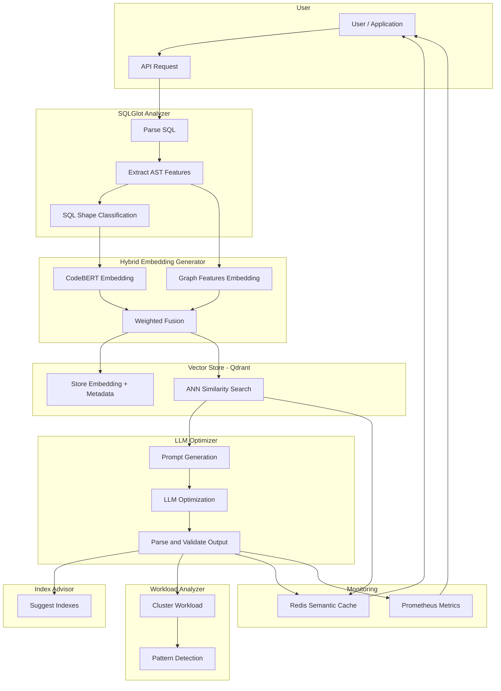

# 🔍 SQL\_Optimizer – SQL Optimization System

A **modular, production-grade system** for intelligent SQL query analysis, semantic search, and optimization. Designed for engineers, DBAs, and researchers, it blends **LLMs, AST analysis, and hybrid vector search** to power high-performance data pipelines.

---

## 🚀 Features

* ✅ **SQL Normalization**: Clean up raw SQL, strip comments, unify formats.
* 🌲 **AST Feature Extraction**: Derive query structures like joins, filters, aggregates.
* 🧠 **AST Shape Classification**: Categorize into logical query shapes (e.g., `JOIN-Heavy`, `SUBQUERY`, `AGGREGATE`).
* 🔗 **Hybrid Embedding Generator**: Fuse semantic (CodeBERT), structural (AST), and optional T5 embeddings.
* 📦 **Dual Vector Store**: Use **Qdrant** for fast ANN search and **Weaviate** for semantic + metadata filtering.
* ⚙️ **LLM-Based Optimization**: Prompt-engineered optimization via Code LLMs (e.g., GPT, Codex).
* 📊 **Index Advisor**: Suggest indexes based on filters, joins, and scan patterns.
* 📈 **Workload Analysis**: Detect heavy patterns, cluster query types.
* 📡 **Prometheus Metrics**: Track optimization stats, latency, inference time, and cache usage.

---

## 🧱 System Architecture



---

## ⚙️ Installation

```bash
git clone https://github.com/your-org/sql-optimization-system.git
cd sql-optimization-system
pip install -r requirements.txt
```

### 📦 Dependencies

* Python ≥ 3.8
* `torch`, `transformers`
* `sqlglot`, `qdrant-client`, `weaviate-client`
* `redis`, `prometheus-client`, `pyyaml`

---

## 🛠️ Configuration

Create `config.yaml` in the project root:

```yaml
vector_stores:
  qdrant:
    host: localhost
    port: 6333
    collection: sql_queries
  weaviate:
    url: http://localhost:8080
    class: SqlQuery

embedding:
  codebert_weight: 0.4
  t5_weight: 0.3
  graph_weight: 0.3
```

---

## 🧪 Usage

### 🔍 As a Library

```python
from codebase import EnhancedSQLGlotAnalyzer, HybridEmbeddingGenerator, DualVectorStore, SQLQuery, OptimizationResult
import hashlib

analyzer = EnhancedSQLGlotAnalyzer()
embedder = HybridEmbeddingGenerator(config)
vector_store = DualVectorStore(qdrant_config, weaviate_config)

sql = "SELECT * FROM users WHERE age > 30"
normalized = analyzer.normalize_sql(sql)
features = analyzer.extract_ast_features(normalized)
shape = analyzer.classify_ast_shape(features)
embedding = embedder.generate_embedding(normalized, features)
query_hash = hashlib.sha256(sql.encode()).hexdigest()

query = SQLQuery(
    original_sql=sql,
    query_hash=query_hash,
    ast_features=features,
    ast_shape=shape,
    embedding=embedding,
    normalized_sql=normalized
)

result = OptimizationResult(
    optimized_sql=normalized,
    optimization_type="SYNTACTIC",
    confidence_score=1.0,
    explanation="No optimization needed."
)

vector_store.store_query(query, result)
```

---

### 🧩 As a Service (REST/Async)

Wrap the core logic in an async loop or FastAPI endpoint for production deployments. Add cache checks, rate limits, and Prometheus middleware for observability.

---

## 📈 Metrics (Prometheus)

Expose optimization metrics via:

```python
from prometheus_client import start_http_server
start_http_server(8000)
```

* `sql_optimization_requests_total`
* `sql_cache_hits_total`
* `sql_optimization_accuracy`
* `sql_optimization_duration_seconds`
* `llm_inference_duration_seconds`

---

## 🔧 Extensibility

| Component         | How to Extend                                                  |
| ----------------- | -------------------------------------------------------------- |
| Optimizers        | Add new logic under `OptimizationType` and inference interface |
| Embeddings        | Plug in additional transformer models                          |
| AST Features      | Modify SQLGlot wrappers for dialect-specific parsing           |
| Index Suggestions | Add heuristics based on table stats and workload               |
| Search Backend    | Support Pinecone, FAISS, or ElasticSearch                      |

---

## 🌐 Related Projects

* [SQLGlot](https://github.com/tobymao/sqlglot)
* [Qdrant](https://qdrant.tech)
* [Weaviate](https://weaviate.io)
* [CodeBERT](https://huggingface.co/microsoft/codebert-base)

---

## 📬 Contact

Built by Bhushan Mandava | [GitHub](https://github.com/bhushanmandava)
🔗 [Portfolio](http://datascienceportfol.io/bhushanmandava16) | ✉️ [bhushanmandava16@gmail.com](mailto:bhushanmandava16@gmail.com)

